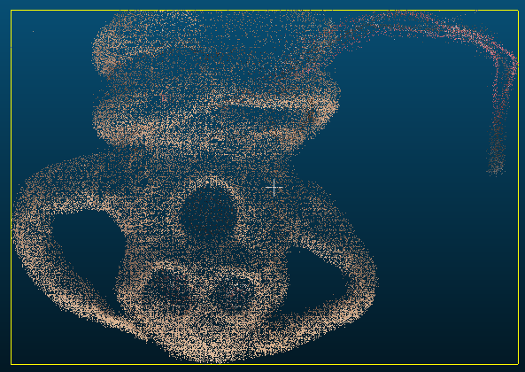

# 3DGS Edit Tools

A Python library to convert 3D Gaussian Splatting (3DGS) format data to CSV format, edit it, and convert it back to 3DGS format.

## Features

- Convert 3DGS format (PLY) data to CSV format
- Convert CSV format data to 3DGS format (PLY)
- Convert 3DGS format to standard point cloud format
- Convert point cloud data to/from CSV format for easy editing
- Tools for comparing 3DGS files and analyzing differences
- Verified compatibility with SuperSplat for visualization
- Point cloud data verified with CloudCompare




## Project Structure

- **src/**: Core functionality for converting between formats (no external dependencies)
- **tools/**: Additional utilities for analyzing and comparing 3DGS files
- **examples/**: Sample code demonstrating usage of the library
- **images/**: Sample images and visualizations

## Dependencies

### Core Library (src/)

The core library in the `src/` folder has **no external dependencies**. It uses only the Python standard library, making it easy to use without additional installation steps.

### Tools (tools/)

The tools in the `tools/` folder require the following dependencies:

```bash
pip install numpy pandas matplotlib
```

## Why CSV Format?

This library uses CSV format as an intermediate step for editing 3D Gaussian Splatting data because:

- **Human-Readable**: CSV files can be easily viewed and edited with spreadsheet software or text editors
- **Ease of Editing**: Unlike binary formats, CSV files allow direct modification of values without specialized tools
- **Compatibility**: CSV is widely supported by data processing tools and programming languages
- **Transparency**: The structure and values are visible, making it easier to understand the data

Point cloud data is also converted to CSV format before editing to maintain the same benefits.

## Installation

Clone this repository:

```bash
git clone https://github.com/404background/3dgs-edit-tools.git
cd 3dgs-edit-tools
```

## Usage

### As a Library

```python
from src import convert_3dgs_to_csv, convert_csv_to_3dgs

# Convert PLY file to CSV
csv_path, _ = convert_3dgs_to_csv('model.ply')

# Write your code to edit the CSV file here
# ...

# Convert edited CSV back to PLY
restored_ply = convert_csv_to_3dgs(csv_path, None)
```

### Point Cloud Workflows

```python
from src import (
    convert_3dgs_to_pointcloud, 
    convert_pointcloud_to_3dgs,
    convert_pointcloud_to_csv,
    convert_csv_to_pointcloud
)

# 3DGS to point cloud
pointcloud_path = convert_3dgs_to_pointcloud('model.ply')

# Point cloud to CSV for easy editing
csv_path = convert_pointcloud_to_csv(pointcloud_path)

# Edit CSV file here...

# CSV back to point cloud
edited_pointcloud = convert_csv_to_pointcloud(csv_path)

# Point cloud back to 3DGS
restored_model = convert_pointcloud_to_3dgs(edited_pointcloud, 'model.ply')
```

### Using Tools

To use the comparison tool for analyzing differences between 3DGS files:

```bash
# First install required dependencies
pip install numpy pandas matplotlib

# Run the comparison tool
python -m tools.compare_gs path/to/original.ply path/to/modified.ply --output-dir comparison_results
```

For more information about available tools, see the [tools/README.md](tools/README.md) file.

### From Command Line

Convert PLY to CSV:

```bash
python -m src.gs_to_csv input.ply --output_csv output.csv
```

Convert CSV to PLY:

```bash
python -m src.csv_to_3dgs input.csv --output_ply output.ply
```

Convert point cloud to CSV:

```bash
python -m src.pointcloud_to_csv ply2csv input_pointcloud.ply --output_csv output.csv
```

Convert CSV to point cloud:

```bash
python -m src.pointcloud_to_csv csv2ply input.csv --output_ply output.ply --color_type uchar
```

### Sample Code

Sample code is available in the `examples` folder. See `examples/README.md` for details.

### Visualization Tools

This project has been tested with the following visualization tools:

- **SuperSplat**: For 3D Gaussian Splatting format files (.ply)
- **CloudCompare**: For point cloud format files (.ply)

All point cloud data conversions have been verified using CloudCompare to ensure proper structure and visual representation.

## API Reference

### Core Conversion Functions

#### convert_3dgs_to_csv(ply_filename, csv_filename=None)

Converts 3DGS format (PLY) data to CSV format.

**Arguments**:
- `ply_filename` (str): Path to the input PLY file
- `csv_filename` (str, optional): Path to the output CSV file. If not specified, it's automatically generated from the input filename

**Returns**:
- tuple: (csv_filename, None) - Paths of the generated files

#### convert_csv_to_3dgs(csv_filename, footer_filename=None, output_ply_filename=None)

Converts CSV format data to 3DGS format (PLY).

**Arguments**:
- `csv_filename` (str): Path to the input CSV file
- `footer_filename` (str, optional): Path to the file containing footer data. If not specified, it's automatically generated from the input filename
- `output_ply_filename` (str, optional): Path to the output PLY file. If not specified, it's automatically generated from the input filename

**Returns**:
- str: Path of the generated PLY file

### Point Cloud Conversion Functions

#### convert_3dgs_to_pointcloud(ply_filename, output_ply_filename=None)

Converts 3D Gaussian Splatting format to standard point cloud PLY format.

**Arguments**:
- `ply_filename` (str): Path to the input 3DGS PLY file
- `output_ply_filename` (str, optional): Path to the output point cloud PLY file

**Returns**:
- str: Path of the generated point cloud file

#### convert_pointcloud_to_3dgs(pointcloud_ply, original_3dgs_ply, output_ply=None)

Converts a point cloud file back to 3D Gaussian Splatting format using an original 3DGS file as reference.

**Arguments**:
- `pointcloud_ply` (str): Path to the input point cloud PLY file
- `original_3dgs_ply` (str): Path to the original 3DGS file to use as reference
- `output_ply` (str, optional): Path to the output 3DGS file

**Returns**:
- str: Path of the generated 3DGS file

#### convert_pointcloud_to_csv(ply_filename, csv_filename=None)

Converts point cloud PLY file to CSV format for easier editing.

**Arguments**:
- `ply_filename` (str): Path to the input point cloud PLY file
- `csv_filename` (str, optional): Path to the output CSV file

**Returns**:
- str: Path of the generated CSV file

#### convert_csv_to_pointcloud(csv_filename, output_ply_filename=None, color_type="uchar")

Converts CSV file to point cloud PLY format.

**Arguments**:
- `csv_filename` (str): Path to the input CSV file
- `output_ply_filename` (str, optional): Path to the output point cloud PLY file
- `color_type` (str): Type of color data to use in PLY file ('float' or 'uchar')

**Returns**:
- str: Path of the generated PLY file

## License

This project is released under the MIT License. See LICENSE file for details.
